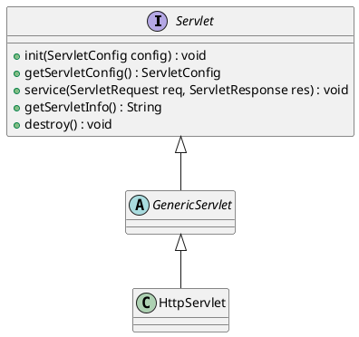

# java
## Web
不知从什么时候开始，我们已经不再关心、甚至根本不知道到底谁调用了我写的程序，反正我写了一个类，甚至从来没有new过，它就跑起来了...
### Servlet
Servlets are the Java platform technology of choice for extending and enhancing Web servers.

```plantuml
@startuml
Servlet <|-- GenericServlet
GenericServlet <|-- HttpServlet
interface Servlet {
    +init(ServletConfig config) : void
    +getServletConfig() : ServletConfig
    +service(ServletRequest req, ServletResponse res) : void
    +getServletInfo() : String
    +destroy() : void
}
abstract class GenericServlet {

}
@enduml
```