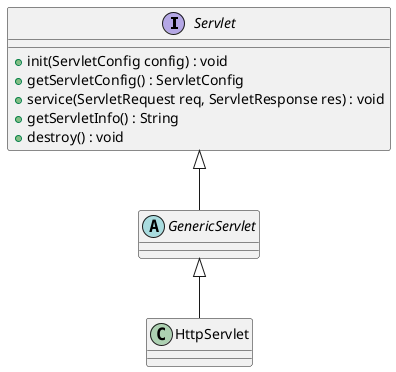

# java
## Web
不知从什么时候开始，我们已经不再关心、甚至根本不知道到底谁调用了我写的程序，反正我写了一个类，甚至从来没有new过，它就跑起来了...
### Servlet
Servlets are the Java platform technology of choice for extending and enhancing Web servers.

#### References
* [Servlet的本质是什么](https://www.zhihu.com/question/21416727)
### Tomcat
Tomcat is primarily a Java servlet container.
#### References
* [An introduction to Tomcat servlet interactions](https://www.mulesoft.com/tcat/tomcat-servlet)
### Spring
* [Web on Servlet Stack](https://docs.spring.io/spring/docs/current/spring-framework-reference/web.html)
#### Spring MVC
Servlets as the Foundation of a Java Web Application, **DispatcherServlet** as the Heart of Spring MVC
#### References
* [How Spring Web MVC Really Works](https://stackify.com/spring-mvc/)
* [How Spring MVC Framework works? How HTTP Request is processed?](https://javarevisited.blogspot.com/2017/06/how-spring-mvc-framework-works-web-flow.html)